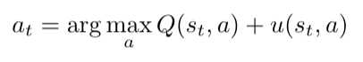
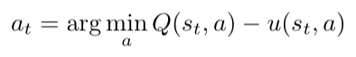
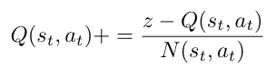
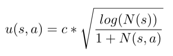

# Monte Carlo Search Tree 🌲

Alpha Zero, like its predecessors: AlphaGo (2016) and AlphaGo Zero (2017), uses Monte Carlo Tree Search (MCTS) as 
its core RL algorithm. Designers of AI Go-playing systems have long recognized MCTS as superior to Minimax for the 
game of Go for the simple reason that Go heuristics, on which Minimax crucially depends, have been extremely evasive: 
even Go experts cannot produce effective heuristics. In MCTS, instead of evaluating leaf nodes of the search tree with 
heuristics, a rollout simulation (using a default action-choice scheme, a.k.a. policy) produces a chain of states from
the leaf to a final state, which is trivial to evaluate since it represents a win, loss or tie for the current player.
MCTS performs hundreds or thousands of such rollouts and averages the results across the search tree as the basis 
for each move in the actual game. Over time, the evaluations of nodes and edges in the tree approach those achieved 
by Minimax, but without the need for a heuristic. MCTS only needs to know the rules of the game and how to evaluate 
final states.
## Tree policy
Since we are playing two player games, player 1 tries to maximize
his number of wins, while player 2 tries to minimize number of winns for player 1. Therefore, 
selecting actions in the tree depends on which player is making the move.  
For player 1 the action selected is defined as: 
  
While for player 2 it is defined as:  
  
where s is the state at time t, and a is the action taken from state s. Q then gives the value for taking
that action in state s. I choosed to define Q as this:  
  
where N(s,a) is the number of traversal of edge (s,a), 
and n(s,a) is the number of those traversal that lead to a win.
We then add u, which we call the exploration bonus. This is defined as:  
  
where c is an exploration constant and N(s) is the number of visits to node s. This combined
is what we call the tree policy which is used during the selection
of next action. 

## Algorithm
The algorithm of MCTS can be summarized into four parts:
* **Selection** - start from the root R and select child nodes using the tree policy
until you reach a leaf node L. The root is the current game state of the actual game and 
a leaf is any node from which a simulation/roll-out has not yet been applied.
The tree policy used is defined as above. 
* **Expansion** - unless L actually ends the game, meaning there is a winner in its state, we 
create all child nodes from L. This is done by computing all legal actions in L's state,
and calculating the next state if you perfrom those actions. One node C
are then chosen, and used to do a simulation.
* **Simulation** - completes one random playout/roll-out from node C. To do the simulation 
I use a default policy which is just defined as choosing uniform random moves until 
the game is in an end state, meaning one of the players won.
* **Backward propagate** - Use the results for the roll-out to update the information
on all nodes on the path from C to the root R. 

## Files

* environment
    * game.py - An abstract Game class and two defined games. Nim and Ledge.
    * state_manager.py - used by the MCTS so that it has no direct communication with any of the games,
    making the algorithm more general.
* game_simulator - Simulates x number of actual games where each action is selected by looking 
at an MCTS where there has been done y number of simulations. 
* mcts.py - This is where the algorithm is implemented.
* tree_node.py - Defines a node in the search tree.
* main.py - Run to start game simulator with the defined configurations in config.yaml
